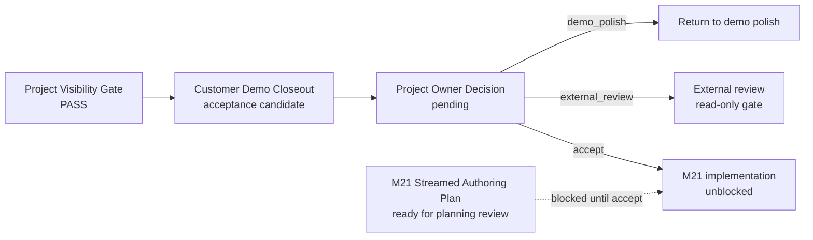

# Project Manager Status Panel

Date: 2026-05-27
Status: project-owner control surface
Worktree: `/Users/Zhuanz/AI-FANTUI-LogicMVP-Workspace/worktrees/multi-agent-active-route-wiring`

## One-Line State

The current completed MVP is an internal multi-agent engineering pipeline MVP,
not yet a project-owner-facing product MVP or a final control-logic workbench.

## What Is Being Built

This branch is building a safe construction system around control-logic
candidate generation:

- AI agents may produce candidate requirements, candidate logic IR, candidate
  evidence, and candidate repairs.
- Deterministic checks and review packets decide whether those candidates are
  acceptable.
- Approved work is recorded through an append-only queue, run ledger, and
  resume cursor.
- Controller truth remains out of scope unless explicitly approved later.

The core principle is:

`AI can propose control-logic candidates; it cannot silently promote them into trusted controller truth.`

## Current MVP Boundary

Current MVP name:
`Multi-Agent Candidate Repair Pipeline MVP`

Current source of truth:

- Contract doc:
  `docs/coordination/multi-agent-control-logic-engineering-system-mvp.md`
- Recovery checkpoint:
  `docs/coordination/multi-agent-continuation-checkpoint.md`
- Latest approved queue:
  `approved-candidate-task-queue-v0.9`
- Latest completed run:
  `RUN-QUEUE-011`
- Latest completed task:
  `TASK-CE-CHECK-OUTPUT-COMMAND-CONFLICT-001`
- Cursor status:
  `idle_no_open_approved_items`

Out of scope for this MVP:

- Editing `src/well_harness/controller.py`
- Claiming certification, DAL readiness, or production control-law readiness
- Building a full customer-facing product dashboard
- Auto-merging or self-approving trusted logic changes
- Proving generalized requirements-to-control-panel generation for new domains
  such as C919 ETRAS

## Project Visibility MVP Entry Point

The formal project-owner entrypoint is now the generated HTML status page.

- Acceptance doc:
  `docs/coordination/project-visibility-mvp-acceptance.md`
- Acceptance command:
  `make project-visibility-mvp-gate`
- Generated HTML entrypoint:
  `/tmp/ai-fantui-project-visibility-mvp-acceptance/project-manager-status-summary/project_manager_status_summary.html`
- Screenshot evidence:
  generated under `/tmp/ai-fantui-project-visibility-mvp-acceptance/`

This entrypoint is an artifact gate, not a live product dashboard.

## Customer Demo MVP Closeout Gate

The Customer Demo MVP closeout gate now combines project visibility evidence
with the existing Phase 1 demo MVP browser/release gate.

- Closeout doc:
  `docs/coordination/customer-demo-mvp-closeout.md`
- Closeout command:
  `make customer-demo-mvp-closeout`
- Demo route:
  `/demo-reconstruction`
- Allowed closeout status:
  `ready_for_project_owner_acceptance`

This closeout remains a project-owner acceptance candidate. It does not claim
production readiness, certification readiness, or controller truth promotion.

## Project Owner Acceptance Review Packet

The final project-owner decision packet gathers the closeout summary, project
status page, screenshots, and non-claim boundaries into one artifact directory.

- Packet doc:
  `docs/coordination/project-owner-acceptance-review-packet.md`
- Packet command:
  `make project-owner-acceptance-review-packet`
- Packet status:
  `ready_for_project_owner_decision`
- Required decision:
  choose exactly one of `accept`, `external_review`, or `demo_polish`

Do not continue M21 queue expansion until this three-option decision is made.

## Project Owner External Review Handoff

The external review path now has a read-only handoff package. It is for a
reviewer to inspect evidence and return one verdict; it is not project-owner
acceptance.

- Handoff doc:
  `docs/coordination/project-owner-external-review-handoff.md`
- Handoff command:
  `make project-owner-external-review-handoff`
- Handoff status:
  `ready_for_read_only_external_review`
- Reviewer verdict:
  choose exactly one of `accept_evidence`, `needs_changes`, or
  `reject_evidence`

The handoff includes the logic circuit diagram screenshot as a required
artifact and checks that it remains the expected 20 nodes / 23 wires evidence
surface.

## External Review Result Intake

Reviewer output now has a small read-only result gate. It verifies that the
review result matches the handoff, cites every required artifact, and preserves
the non-claim boundary.

- Result doc:
  `docs/coordination/project-owner-external-review-result.md`
- Result command:
  `PROJECT_OWNER_EXTERNAL_REVIEW_RESULT_PATH=/path/to/review.json make project-owner-external-review-result`
- Valid reviewer verdict:
  choose exactly one of `accept_evidence`, `needs_changes`, or
  `reject_evidence`

Even a verified `accept_evidence` result leaves final acceptance as
`not_granted` until the project owner chooses `accept`.

## Project Owner Final Decision Gate

The final decision now has a verifier, but no default acceptance is generated.
It reads an explicit project-owner decision JSON and validates that the selected
option is one of `accept`, `external_review`, or `demo_polish`.

- Decision doc:
  `docs/coordination/project-owner-final-decision.md`
- Decision command:
  `PROJECT_OWNER_FINAL_DECISION_PATH=/path/to/decision.json make project-owner-final-decision`
- Accept unblocks M21 only when:
  decision status is `customer_demo_mvp_accepted`

`accept` requires the external review result status
`external_review_accepts_evidence` and records final acceptance as
`granted_for_customer_demo_mvp_evidence_only`.

## Strategic Target: Generalized Logic Circuit Panel

The important long-term target is a generalized requirements-to-control-panel
capability, not only the current demo cockpit diagram.

- Target doc:
  `docs/coordination/generalized-logic-circuit-control-panel-target.md`
- Interaction target:
  `docs/coordination/engineer-in-the-loop-streamed-logic-authoring-target.md`
- Example future input:
  C919 ETRAS requirements document
- Expected future output:
  a logic circuit control panel of comparable quality to the current demo
  cockpit panel
- Required trust mechanism:
  streamed node/wire proposals with user confirmation before commit
- Current milestone claim:
  demo evidence only, not generalized generation

This target should be planned as a future milestone with its own ingestion,
logic-IR, streamed authoring, rendering, screenshot, and review gates.

## M21 Candidate: Streamed Authoring Specialist Team

The next planning package keeps development in the multi-agent specialist-team
mode instead of a single-agent implementation path.

- Plan doc:
  `docs/coordination/streamed-logic-authoring-multi-agent-plan.md`
- Plan command:
  `make multi-agent-m21-streamed-logic-authoring-plan`
- Plan status:
  `ready_for_m21_planning_review`
- Activation status:
  `blocked_until_project_owner_final_acceptance`
- Operating mode:
  `multi_agent_specialist_team`

The specialist team includes separate owners for requirements interpretation,
atomic graph-edit proposals, candidate Logic IR stewardship, interaction UX,
requirements-change authorization, evidence gates, and external review.

## Completed

### Engineering Control Plane

- Chief Engineer task package exists.
- Dry-run execution planning exists.
- Approved restricted execution shell exists.
- Candidate review packet and export path exist.
- Safety, Evidence, and Requirement repair loops exist.
- Queue, ledger, and resume cursor exist.
- Compact-failure-safe checkpoint exists.

### Queue Progress

The append-only queue has completed 11 candidate repair records:

| Record | Queue item | Finding | Result |
| --- | --- | --- | --- |
| RUN-QUEUE-001 | safety priority repair | `CHECK_SAFETY_PRIORITY_001` | converged |
| RUN-QUEUE-002 | failed simulation result repair | `EV_SIMULATION_RESULT_FAILED` | converged |
| RUN-QUEUE-003 | missing test result repair | `EV_TEST_RESULT_MISSING` | converged |
| RUN-QUEUE-004 | requirement ambiguity repair | `REQ_AMBIGUITY_UNRESOLVED` | converged |
| RUN-QUEUE-005 | undefined signal repair | `CHECK_UNDEFINED_SIGNAL_001` | converged |
| RUN-QUEUE-006 | boundary review repair | `EV_BOUNDARY_RESULT_REVIEW_REQUIRED` | converged |
| RUN-QUEUE-007 | unknown test coverage repair | `EV_TEST_COVERS_UNKNOWN_REQUIREMENT` | converged |
| RUN-QUEUE-008 | unknown IR trace repair | `EV_IR_TRACE_UNKNOWN_REQUIREMENT` | converged |
| RUN-QUEUE-009 | transition endpoint repair | `CHECK_TRANSITION_ENDPOINT_001` | converged |
| RUN-QUEUE-010 | unreachable state repair | `CHECK_UNREACHABLE_STATE_001` | converged |
| RUN-QUEUE-011 | output command conflict repair | `CHECK_OUTPUT_COMMAND_CONFLICT_001` | converged |

### Latest Slice

M27 promoted the v0.9 queue into the current v0.2 ledger/cursor baseline.

The latest completed queue item is the output-command conflict repair. It
marks the seeded conflicting transition as safety-priority, keeps the repair
candidate-only, and does not promote controller truth.

### Verification State

Latest focused verification passed:

- targeted pytest set: `24 passed`
- M26 output-command conflict slice gate: pass
- v0.9 approved queue artifact: pass
- v0.2 queue run ledger: pass
- v0.2 queue cursor state: pass
- compact-safe checkpoint proof: pass
- syntax compile: pass
- `git diff --check`: pass
- forbidden controller/UI path guard: pass

## Current Stage Visualization

Current reading:

- Project Visibility is no longer missing; it has a generated HTML entrypoint
  and acceptance gate.
- Customer Demo Closeout is packaged as a project-owner acceptance candidate.
- Final project-owner decision is still pending.
- M21 streamed authoring is ready as a planning package only; implementation is
  blocked until final acceptance.

## Not Completed

### Final Project Owner Decision

- No explicit project-owner decision JSON has been accepted yet.
- The current valid choices are exactly `accept`, `external_review`, or
  `demo_polish`.
- M21 queue expansion remains blocked until `accept` produces
  `customer_demo_mvp_accepted`.

### Customer-Facing Product Scope

- The multi-agent engineering pipeline is not the final customer-facing
  control-logic workbench.
- The demo reconstruction route is packaged as evidence, not production
  readiness.
- The generalized C919 ETRAS-style requirements-to-control-panel capability is
  documented as a strategic target, not yet implemented.

### Review and Governance

- External review is available as a formal read-only path, but it has not been
  completed in this status panel.
- `accept` requires external evidence acceptance before final acceptance is
  granted for the customer demo evidence.
- The current queue repairs are candidate-only; they do not prove real control
  correctness.

### Scope Control

- The worktree is still very dirty from accumulated prior work.
- Several files and artifacts are untracked because this branch has been used
  as a long-running construction lane.
- The dirty worktree itself is not a blocker, but every final packet should use
  path-scoped artifact indexes rather than broad repository status.

## Main Risks

| Risk | Current level | Why it matters | Recommended control |
| --- | --- | --- | --- |
| Internal pipeline growth hides product progress | Medium | Project Visibility and closeout gates now exist, but M21 could still obscure project-owner acceptance | Keep M21 blocked until final decision |
| Candidate repair semantics become too aggressive | Medium | Some repairs could silently invent state-machine meaning | Keep repairs candidate-only and narrowly reviewed |
| Project owner cannot see state quickly | Medium | The HTML entrypoint exists, but artifact paths are still scattered across `/tmp` packages | Maintain this status panel and artifact index after each milestone |
| Controller truth boundary drift | Low currently | Guard passed and protected paths are clean | Keep forbidden-path guard in every closeout |
| Dirty worktree confusion | Medium | Existing unrelated changes make status and review harder | Use path-scoped summaries and avoid broad cleanup without approval |

## Project Owner Decision Matrix

| Choice | Final acceptance | M21 queue unblocked | Next action |
| --- | --- | --- | --- |
| `accept` | granted for customer demo evidence only, after external evidence acceptance | yes | start M21 as the streamed authoring specialist-team implementation milestone |
| `external_review` | not granted | no | send the handoff packet to a read-only reviewer and ingest one verdict |
| `demo_polish` | not granted | no | return to the customer demo route and improve visible evidence before another decision |

The `accept` path does not mean production readiness, certification readiness,
or controller truth promotion. It only accepts the current customer demo evidence
and unlocks M21 implementation planning.

## Artifact Index

| Artifact | Path or command | Purpose |
| --- | --- | --- |
| Project Visibility HTML | `/tmp/ai-fantui-project-visibility-mvp-acceptance/project-manager-status-summary/project_manager_status_summary.html` | formal project-owner entrypoint |
| Project Visibility gate | `make project-visibility-mvp-gate` | validates status page and screenshot gate |
| Customer Demo Closeout | `make customer-demo-mvp-closeout` | packages demo evidence for owner acceptance |
| Acceptance Review Packet | `make project-owner-acceptance-review-packet` | gathers closeout JSON/Markdown, status page, screenshots, and non-claims |
| External Review Handoff | `make project-owner-external-review-handoff` | read-only reviewer packet |
| Final Decision Gate | `PROJECT_OWNER_FINAL_DECISION_PATH=/path/to/decision.json make project-owner-final-decision` | validates exactly one owner decision |
| M21 Streamed Authoring Plan | `make multi-agent-m21-streamed-logic-authoring-plan` | prepares the multi-agent specialist-team plan while keeping implementation blocked |

## Recommended Decision

Do not continue M21 immediately.

The next best move is:

1. Use the acceptance review packet and final-decision gate as the project-owner
   control surface.
2. Choose exactly one of `accept`, `external_review`, or `demo_polish`.
3. Start M21 implementation only if the final decision is `accept` and the gate
   returns `customer_demo_mvp_accepted`.

## Stop Conditions

Stop and reassess if any of these happen:

- `src/well_harness/controller.py` appears in the diff.
- The cursor is no longer idle after M20.
- A new queue item requires adding state-machine semantics instead of
  candidate-only metadata.
- The next task cannot be explained in project-owner language.
- More internal artifacts are added without updating this status panel.
